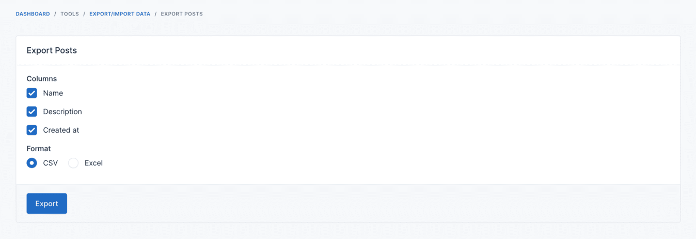
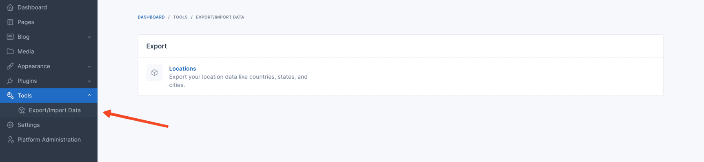
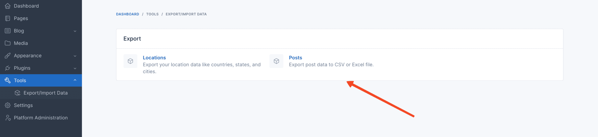
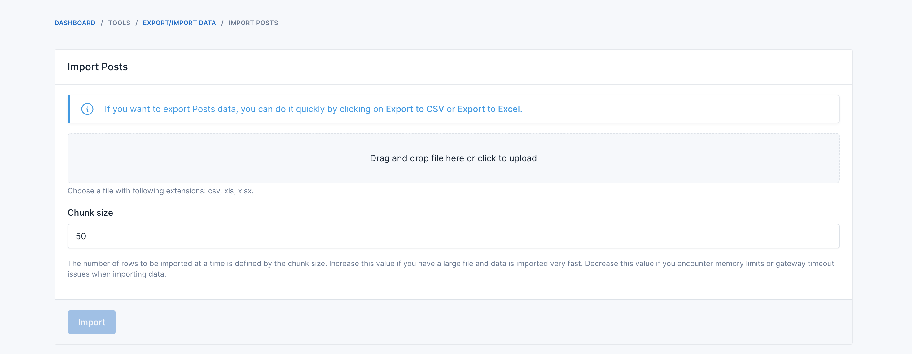

# Data Synchronize

## Usage

### Exporter

There are two ways to create an exporter.



#### Create an exporter using the command

You can use the `php artisan data-synchronize:make:exporter` command to create an exporter.

```bash
php artisan data-synchronize:make:exporter PostExporter
```

#### Manually create an exporter

This is how an exporter should look like, below is an example of a `PostExporter` class.

```php
<?php

namespace Botble\Blog\Exporters;

use Botble\Blog\Models\Post;
use Botble\DataSynchronize\Exporter\ExportColumn;
use Botble\DataSynchronize\Exporter\Exporter;
use Illuminate\Support\Collection;

class PostExporter extends Exporter
{
    public function label(): string
    {
        return 'Posts';
    }

    public function columns(): array
    {
        return [
            ExportColumn::make('name'),
            ExportColumn::make('description'),
            ExportColumn::make('created_at'),
        ];
    }

    public function collection(): Collection
    {
        return Post::all();
    }
}
```

This is how to use the exporter in a controller.

```php
<?php

namespace Botble\Blog\Http\Controllers;

use Botble\DataSynchronize\Exporter\Exporter;
use Botble\DataSynchronize\Http\Controllers\ExportController;
use Botble\Blog\Exporters\PostExporter;

class ExportPostController extends ExportController
{
    protected function getExporter(): Exporter
    {
        return PostExporter::make();
    }
}
```

And then register the route in your routes file.

```php
use Botble\Base\Facades\AdminHelper;
use Illuminate\Support\Facades\Route;
use Botble\Blog\Http\Controllers\ExportPostController;

AdminHelper::registerRoutes(function () {
    Route::prefix('tools/data-synchronize')->name('tools.data-synchronize.')->group(function () {
        Route::group(['prefix' => 'export/posts', 'as' => 'export.posts.', 'permission' => 'posts.export'], function () {
            Route::get('/', [ExportPostController::class, 'index'])->name('index');
            Route::post('/', [ExportPostController::class, 'store'])->name('store');
        });
    });
});
```

Each exporter route should have a permission to access it. You can use the `permission` key in the route group to define
the permission.

In above route definition, the permission is `posts.export` key and it parent is `tools.data-synchronize`. You can
define the permission in the `permissions.php` of your plugin.

```php
return [
    [
        'name' => 'Export Posts',
        'flag' => 'posts.export',
        'parent_flag' => 'tools.data-synchronize',
    ],
];
```

Now you can navigate to `http://your-domain/tools/data-synchronize/export/posts` to export posts.

#### Add exporter to Export/Import Data panel section



To add the exporter to the Export/Import Data panel section, you can use the `beforeRendering` method of
the `PanelSectionManager` class to register the exporter into the panel section.

```php
use Botble\Base\Facades\PanelSectionManager;
use Botble\Base\PanelSections\PanelSectionItem;
use Botble\DataSynchronize\PanelSections\ExportPanelSection;

public function boot(): void
{
    // ...

    PanelSectionManager::setGroupId('data-synchronize')->beforeRendering(function () {
        PanelSectionManager::default()
            ->registerItem(
                ExportPanelSection::class,
                fn () => PanelSectionItem::make('posts')
                    ->setTitle('Posts')
                    ->withDescription('Export post data to CSV or Excel file.')
                    ->withPriority(120)
                    ->withRoute('tools.data-synchronize.export.posts.index')
                    ->withPermission('posts.export')
            );
    });
    
    // ...
}
```

You can see the exporter in the **Export/Import Data** panel section.



### Importer

There are two ways to create an importer.



#### Create an importer using the command

You can use the `php artisan data-synchronize:make:importer` command to create an importer.

```bash
php artisan data-synchronize:make:importer PostImporter
```

#### Manually create an importer

This is how an importer should look like, below is an example of a `PostImporter` class.

```php
<?php

namespace Botble\Blog\Importers;

use Botble\Blog\Models\Post;
use Botble\DataSynchronize\Importer\ImportColumn;
use Botble\DataSynchronize\Importer\Importer;

class PostImporter extends Importer
{
    public function chunkSize(): int
    {
        return 1000;
    }

    public function label(): string
    {
        return 'Posts';
    }
    
    public function getValidateUrl(): string
    {
        return route('tools.data-synchronize.import.posts.validate');
    }

    public function getImportUrl(): string
    {
        return route('tools.data-synchronize.import.posts.store');
    }

    public function getDownloadExampleUrl(): ?string
    {
        return route('tools.data-synchronize.import.posts.download-example');
    }

    public function columns(): array
    {
        return [
            ImportColumn::make('name')->rules(['required', 'string']),
            ImportColumn::make('description')->rules(['required', 'string']),
            ImportColumn::make('created_at')->rules(['required', 'string']),
        ];
    }
    
    public function examples(): array
    {
        return [
            [
                'name' => 'Post 1',
                'description' => 'Description 1',
                'created_at' => '2021-01-01 00:00:00',
            ],
            [
                'name' => 'Post 2',
                'description' => 'Description 2',
                'created_at' => '2021-01-02 00:00:00',
            ],
        ];
    }

    public function handle(array $data): int
    {
        $total = 0;
        
        foreach ($data as $item) {
            Post::create($item);
            $total++;
        }
        
        return $total;
    }
}
```

This is how to use the importer in a controller.

```php
<?php

namespace Botble\Blog\Http\Controllers;

use Botble\DataSynchronize\Http\Controllers\ImportController;
use Botble\DataSynchronize\Importer\Importer;

class ImportPostController extends ImportController
{
    protected function getImporter(): Importer
    {
        return PostImporter::make();
    }
}
```

And then register the route in your routes file.

```php
use Botble\Base\Facades\AdminHelper;

AdminHelper::registerRoutes(function () {
    Route::prefix('tools/data-synchronize')->name('tools.data-synchronize.')->group(function () {
        Route::group(['prefix' => 'import/posts', 'as' => 'import.posts.', 'permission' => 'posts.import'], function () {
            Route::get('/', [ImportPostController::class, 'index'])->name('index');
            Route::post('', [ImportPostController::class, 'store'])->name('store');
            Route::post('validate', [ImportPostController::class, 'validateData'])->name('validate');
            Route::get('download-example', [ImportPostController::class, 'downloadExample'])->name('download-example');
        });
    });
});
```

Each importer route should have a permission to access it. You can use the `permission` key in the route group to define the permission.

In above route definition, the permission is `posts.import` key and it parent is `tools.data-synchronize`. You can define the permission in the `permissions.php` of your plugin.

```php
return [
    [
        'name' => 'Import Posts',
        'flag' => 'posts.import',
        'parent_flag' => 'tools.data-synchronize',
    ],
];
```

Now you can navigate to `http://your-domain/tools/data-synchronize/import/posts` to import posts.

#### Add importer to Export/Import Data panel section

To add the importer to the Export/Import Data panel section, you can use the `beforeRendering` method of the `PanelSectionManager` class to register the importer into the panel section.

```php
use Botble\Base\Facades\PanelSectionManager;
use Botble\Base\PanelSections\PanelSectionItem;
use Botble\DataSynchronize\PanelSections\ImportPanelSection;

public function boot(): void
{
    // ...

    PanelSectionManager::setGroupId('data-synchronize')->beforeRendering(function () {
        PanelSectionManager::default()
            ->registerItem(
                ImportPanelSection::class,
                fn () => PanelSectionItem::make('posts')
                    ->setTitle('Posts')
                    ->withDescription('Import post data from CSV or Excel file.')
                    ->withPriority(120)
                    ->withRoute('tools.data-synchronize.import.posts.index')
                    ->withPermission('posts.import')
            );
    });
    
    // ...
}
```

You can see the importer in the **Export/Import Data** panel section.

### Import/Export data from command line


